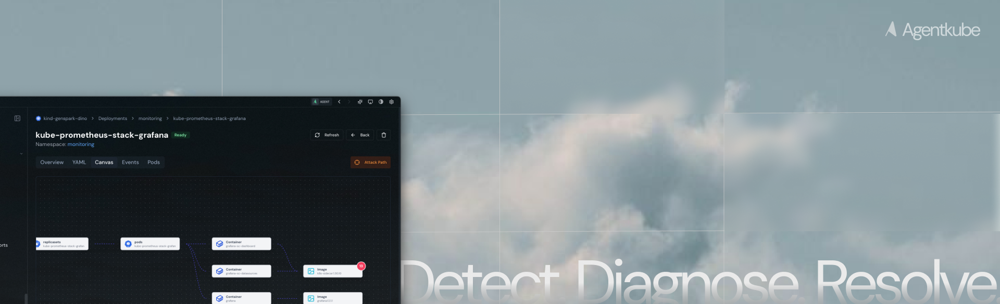

<!-- TEXT_SECTION:header:START -->
<div>
  <p align="center">
    <a href="https://agentkube.com" target="_blank">Website</a>&nbsp;&#8226;&nbsp;
    <a href="https://agentkube.com/pricing" target="_blank">Pricing</a>&nbsp;&#8226;&nbsp;
    <a href="https://docs.agentkube.com" target="_blank">Docs</a>&nbsp;&#8226;&nbsp;
    <a href="https://docs.agentkube.com/changelog" target="_blank">Changelog</a>&nbsp;&#8226;&nbsp;
    <a href="https://agentkube.com/about" target="_blank">About</a>&nbsp;&#8226;&nbsp;
    <a href="https://agentkube.com/contact" target="_blank">Contact</a>&nbsp;&#8226;&nbsp;
    <a href="https://github.com/agentkube/agentkube/issues" target="_blank">Issue Tracker</a>&nbsp;&#8226;&nbsp;
    <a href="https://account.agentkube.com" target="_blank">SignUp</a>&nbsp;&nbsp;
  </p>
  <h3 align="center">
    Run Kubernetes Like Never Before
  </h3>
  <p align="center">
  Meet the AI-powered future of Kubernetes management. <br />
  Automate, optimize, and secure your clusters effortlessly with Agentkube.
  </p>

</div>

## What is Agentkube?

Agentkube is an AI-powered Kubernetes IDE that bridges the gap between developers and complex cluster operations. It simplifies Kubernetes adoption by automating cluster management, investigating issues, and providing intelligent solutions - all through an intuitive interface that speaks your language.

Whether you’re a developer looking to scale your application or a DevOps engineer streamlining operations, Agentkube reduces the to reduce incident response time while maintaining enterprise-grade reliability.

## Features
- **Bring Your Own Key** — Supports 20+ LLM providers including OpenAI, Anthropic, Google Gemini, Mistral, Cohere, and more.
- **Local LLM Support** — Run models locally with Ollama and vLLM for air-gapped and privacy-first environments.
- **Human in the Loop** — Approve or reject agent tool calls before execution for full operational control.
- **Deep Investigation & Root Cause Analysis** — Multi-agent orchestration system that automatically investigates cluster issues, analyzes resource states, and surfaces actionable root causes.
- **Log Viewer with LogQL Query Builder** — Explore and query logs with a built-in LogQL interface for structured log exploration.
- **PromQL Query Builder** — Query Prometheus metrics and execute them directly from the spotlight interface.
- **Recon Mode** — Restrict cluster access to read-only operations.
- **Custom Monitoring Dashboard** — Build and view real-time monitoring dashboards tailored to your cluster workloads.
- **Quick Log & Event Analysis** — AI-powered log and event analyzers that surface anomalies and patterns in seconds.
- **Built-in Grype Integration** — Scan container images for vulnerabilities directly from the resource panel.
- **Resource Canvas & Attack Path Analysis** — Interactive map view of how Kubernetes resources connect with each other. Visualizes dependencies, traffic flows, and attack paths to help engineers understand cluster structure and debug issues.


- **16+ UI Themes** — Pick a color scheme that fits your workflow, from minimal to dark matter.
- **MCP Marketplace** — Discover and install plugins with one click, directly inside the IDE. No manual setup required.
- **Kubernetes Resource Recommender (KRR)** — Built-in resource recommendation engine for right-sizing CPU and memory requests across workloads.
- **Integration** — Trivy, ArgoCD and more.


## Getting Started

Before installing Agentkube, ensure your system meets the minimum requirements:

- **macOS:** 10.14 or higher
- **Windows:** Windows 10 or higher
- **Linux:** Most modern Linux distributions (AMD64 only)

### Installation

Install via Homebrew (macOS):

```bash
brew install --cask agentkube
```

Or download the latest version (v0.0.12) directly:

- **Mac** [[Arm](https://github.com/agentkube/agentkube/releases/download/v0.0.12/Agentkube_0.0.12_aarch64.dmg)] [[Intel](https://github.com/agentkube/agentkube/releases/download/v0.0.12/Agentkube_0.0.12_x64.dmg)]
- **Windows** [[64-bit](https://github.com/agentkube/agentkube/releases/download/v0.0.12/Agentkube_0.0.12_x64-setup.exe)] [[32-bit](https://github.com/agentkube/agentkube/releases/download/v0.0.12/Agentkube_0.0.12_x86-setup.exe)]
- **Linux** [[Deb](https://github.com/agentkube/agentkube/releases/download/v0.0.12/Agentkube_0.0.12_amd64.deb)] [[RPM](https://github.com/agentkube/agentkube/releases/download/v0.0.12/Agentkube-0.0.12-1.x86_64.rpm)]

> **Note:** Windows version is not signed - choose "More info > Run anyway" when prompted.

For comprehensive documentation, visit [docs.agentkube.com](https://docs.agentkube.com).

## Community & Support

- **Discord** Join our community at [discord.gg/UxnwzcjMWA](https://discord.gg/UxnwzcjMWA)
- **Issue Tracker** [github.com/agentkube/agentkube/issues](https://github.com/agentkube/agentkube/issues)

## Contributing

We welcome contributions from the community! Whether it's bug reports, feature requests, documentation improvements, or code changes -- every contribution matters.

- **[Contributing Guide](CONTRIBUTING.md)** -- How to contribute, coding standards, and PR workflow
- **[Development Guide](DEVELOPMENT.md)** -- Setting up your local development environment
- **[Code of Conduct](CODE_OF_CONDUCT.md)** -- Community standards and expectations

For questions or concerns about community guidelines, contact us at [`info@agentkube.com`](mailto:info@agentkube.com).

## License

This project is licensed under the Apache License 2.0. See the [LICENSE](LICENSE) file for details.

© 2025 Agentkube. All Rights Reserved.

