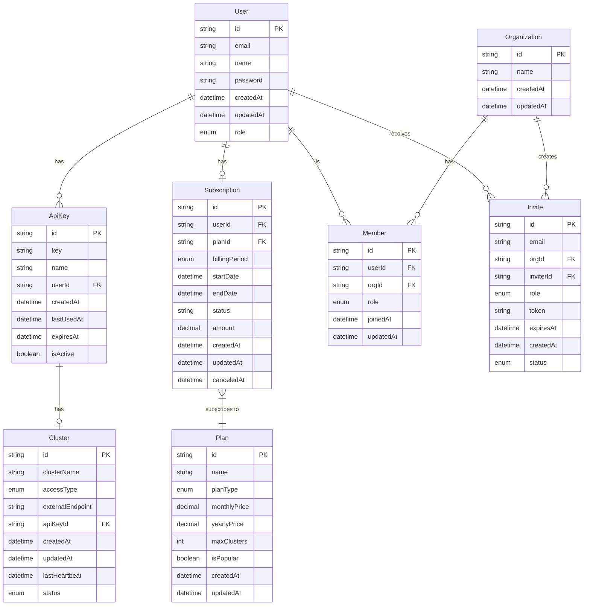

# Agentkube


```mermaid
erDiagram
    User ||--o{ ApiKey : "has"
    User ||--o| Subscription : "has"
    User ||--o{ Member : "is"
    User ||--o{ Invite : "receives"
    Organization ||--o{ Member : "has"
    Organization ||--o{ Invite : "creates"
    ApiKey ||--o| Cluster : "has"
    Subscription }|--|| Plan : "subscribes to"

    User {
        string id PK
        string email
        string name
        string password
        datetime createdAt
        datetime updatedAt
        enum role
    }

    Organization {
        string id PK
        string name
        datetime createdAt
        datetime updatedAt
    }

    Member {
        string id PK
        string userId FK
        string orgId FK
        enum role
        datetime joinedAt
        datetime updatedAt
    }

    Invite {
        string id PK
        string email
        string orgId FK
        string inviterId FK
        enum role
        string token
        datetime expiresAt
        datetime createdAt
        enum status
    }

    ApiKey {
        string id PK
        string key
        string name
        string userId FK
        datetime createdAt
        datetime lastUsedAt
        datetime expiresAt
        boolean isActive
    }

    Cluster {
        string id PK
        string clusterName
        enum accessType
        string externalEndpoint
        string apiKeyId FK
        datetime createdAt
        datetime updatedAt
        datetime lastHeartbeat
        enum status
    }

    Plan {
        string id PK
        string name
        enum planType
        decimal monthlyPrice
        decimal yearlyPrice
        int maxClusters
        boolean isPopular
        datetime createdAt
        datetime updatedAt
    }

    Subscription {
        string id PK
        string userId FK
        string planId FK
        enum billingPeriod
        datetime startDate
        datetime endDate
        string status
        decimal amount
        datetime createdAt
        datetime updatedAt
        datetime canceledAt
    }
```

To install dependencies:

```bash
bun install
```

To run:

```bash
bun run index.ts
```

This project was created using `bun init` in bun v1.0.0. [Bun](https://bun.sh) is a fast all-in-one JavaScript runtime.

✔ Your Prisma schema was created at prisma/schema.prisma
  You can now open it in your favorite editor.

warn You already have a .gitignore file. Don't forget to add `.env` in it to not commit any private information.

Next steps:
1. Set the DATABASE_URL in the .env file to point to your existing database. If your database has no tables yet, read https://pris.ly/d/getting-started
2. Run prisma db pull to turn your database schema into a Prisma schema.
3. Run prisma generate to generate the Prisma Client. You can then start querying your database.
4. Tip: Explore how you can extend the ORM with scalable connection pooling, global caching, and real-time database events. Read: https://pris.ly/cli/beyond-orm

More information in our documentation:
https://pris.ly/d/getting-started

## Migration

```bash
bunx prisma migrate dev --name init 
```