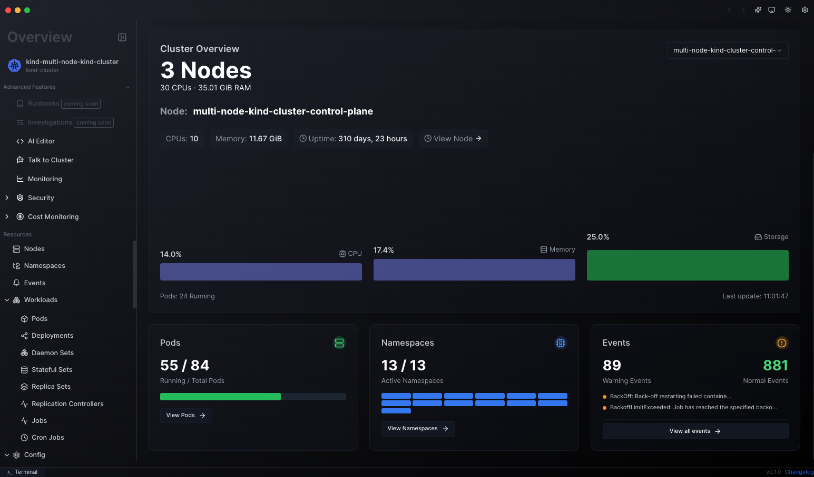

<!-- TEXT_SECTION:header:START -->
<div>
  <p align="center">
    <a href="https://agentkube.com" target="_blank">Website</a>&nbsp;&#8226;&nbsp;
    <a href="https://agentkube.com/pricing" target="_blank">Pricing</a>&nbsp;&#8226;&nbsp;
    <a href="https://docs.agentkube.com" target="_blank">Docs</a>&nbsp;&#8226;&nbsp;
    <a href="https://docs.agentkube.com/changelog" target="_blank">Changelog</a>&nbsp;&#8226;&nbsp;
    <a href="https://agentkube.com/about" target="_blank">About</a>&nbsp;&#8226;&nbsp;
    <a href="https://agentkube.com/contact" target="_blank">Contact</a>&nbsp;&#8226;&nbsp;
    <a href="https://github.com/agentkube/agentkube/issues" target="_blank">Issue Tracker</a>&nbsp;&#8226;&nbsp;
    <a href="https://account.agentkube.com" target="_blank">SignUp</a>&nbsp;&nbsp;
  </p>
  <h3 align="center">
    Run Kubernetes Like Never Before
  </h3>
  <p align="center">
  Meet the AI-powered future of Kubernetes management. <br />
  Automate, optimize, and secure your clusters effortlessly with Agentkube.
  </p>

</div>

## What is Agentkube?

Agentkube is an AI-powered Kubernetes management platform that bridges the gap between developers and complex cluster operations. It simplifies Kubernetes adoption by automating cluster management, investigating issues, and providing intelligent solutions - all through an intuitive interface that speaks your language.

Whether you're a developer looking to scale your application or a DevOps engineer streamlining operations, Agentkube reduces incident response time while maintaining enterprise-grade reliability.


> **⚠️ Open Source Transition Notice**
> We're actively working on open-sourcing Agentkube! As part of this transition, you may notice that some binaries and portions of the codebase are not yet publicly available. We're committed to preparing a clean, well-documented open-source release and expect to complete this process soon. Thank you for your patience and support as we work towards full transparency. Stay tuned for updates!

## Getting Started

Before installing Agentkube, ensure your system meets the minimum requirements:

- **macOS:** 10.14 or higher
- **Windows:** Windows 10 or higher
- **Linux:** Most modern Linux distributions (AMD64 only)

### Installation

Install via Homebrew (macOS):

```bash
brew install --cask agentkube
```

Or download the latest version (v0.0.11) directly:

- **Mac** [[Arm](https://github.com/agentkube/agentkube/releases/download/v0.0.11/Agentkube_0.0.11_aarch64.dmg)] [[Intel](https://github.com/agentkube/agentkube/releases/download/v0.0.11/Agentkube_0.0.11_x64.dmg)]
- **Windows** [[64-bit](https://github.com/agentkube/agentkube/releases/download/v0.0.11/Agentkube_0.0.11_x64-setup.exe)] [[32-bit](https://github.com/agentkube/agentkube/releases/download/v0.0.11/Agentkube_0.0.11_x86-setup.exe)]
- **Linux** [[Deb](https://github.com/agentkube/agentkube/releases/download/v0.0.11/Agentkube_0.0.11_amd64.deb)] [[RPM](https://github.com/agentkube/agentkube/releases/download/v0.0.11/Agentkube-0.0.11-1.x86_64.rpm)]

> **Note:** Windows version is not signed - choose "More info > Run anyway" when prompted.

For comprehensive documentation, visit [docs.agentkube.com](https://docs.agentkube.com).

## Community & Support

- **Discord** Join our community at [discord.gg/UxnwzcjMWA](https://discord.gg/UxnwzcjMWA)
- **Issue Tracker** [github.com/agentkube/agentkube/issues](https://github.com/agentkube/agentkube/issues)

## Contributing

We welcome contributions from the community! Please read our [Code of Conduct](CODE_OF_CONDUCT.md) before contributing.

For questions or concerns about community guidelines, contact us at [`info@agentkube.com`](mailto:info@agentkube.com).

## License

This project is licensed under the Apache License 2.0. See the [LICENSE](LICENSE) file for details.

© 2025 Agentkube. All Rights Reserved.

